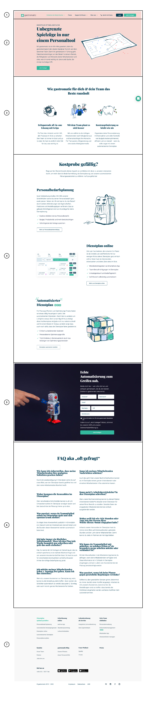

## Aufgabe

[Diese Seite](https://www.gastromatic.com/de/dienstplan-optimal-gestalten/) nachbauen - siehe Screenshot. Hierzu dieses Repository klonen und die `index.tsx` modifizieren. Das Projekt basiert auf Next.js und Typescript. 


## Einteilung der Seite in (siehe Screenshot):

1. **Navigation** - Keine Interaktion mit Hover etc. notwendig, muss auch keine Verlinkungen haben - lediglich der Look soll stimmen
2. **Header** - ”Dienstplan optimal gestalten”
3. **Sektion 1** - “Wie gastromatic für dich & dein Team das Beste rausholt” 
4. **Sektion 2** - “Kostprobe gefällig?”
5. **CTA Sektion** - “Echte Automatisierung zum Greifen nah.”
6. **FAQ Sektion** - “FAQ aka oft gefragt”
    - Hier bitte eine Component für Frage/Antwort erstellen um den Code cleaner zu halten
7. **Footer** - Lediglich das Visuelle nachbauen - muss nicht verlinken

## Anforderungen:

- [**Styled-Components**](https://styled-components.com/) for Styling - Globale Stylings wie Überschriften etc. können über die `styles/globals.css` gepackt werden
- Es soll **mindestens 2 UI Komponenten** gebaut werden - hierfür gibt es bereits einen `/components` Ordner
    - **Button**: mit den Properties size & type
    - **Frage/Antwort:** mit den Properties question & answer
- **Fonts to use (sind bereits eingebunden)**: Playfair Display (Überschriften), Roboto (Fließtext, Buttons, Formulare etc.)
- Für alle Farben bitte die Variablen aus dem **Theme File** `styles/theme.ts` verwenden - kann in `index.tsx` importiert und in styled components verwendet werden.

**Alle Bilder sind bereits im `/images` Ordner hinterlegt!**

## Getting Started

First, run the development server:

```bash
npm run dev
# or
yarn dev
```

Open [http://localhost:3000](http://localhost:3000) with your browser to see the result.

You can start editing the page by modifying `pages/index.tsx`. The page auto-updates as you edit the file.

## Next.js Docs

To learn more about Next.js, take a look at the following resources:

- [Next.js Documentation](https://nextjs.org/docs) - learn about Next.js features and API.
- [Learn Next.js](https://nextjs.org/learn) - an interactive Next.js tutorial.

You can check out [the Next.js GitHub repository](https://github.com/vercel/next.js/) - your feedback and contributions are welcome!